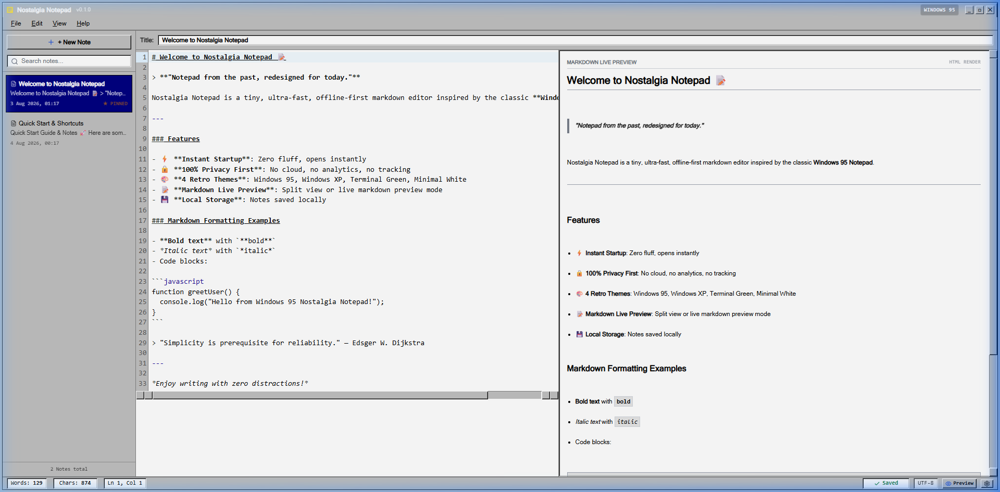
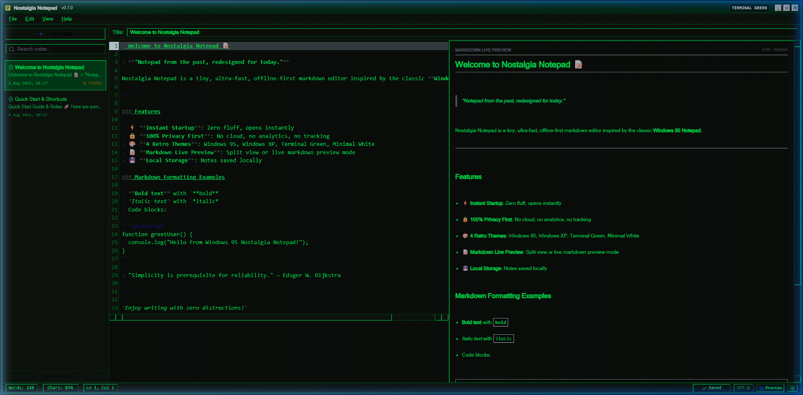
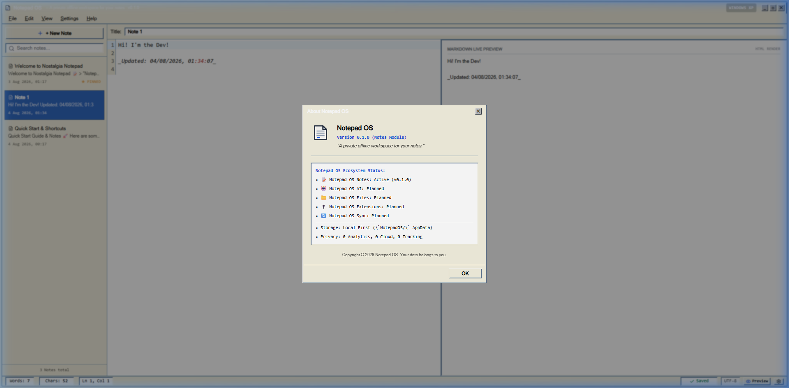

# Notepad OS

A privacy-first local productivity environment starting with a lightweight markdown notes application.

---

## ⚠️ Known Issues (v0.1.1)

> These are actively tracked bugs. See [ISSUES.md](ISSUES.md) for full details and workarounds.

| # | Issue | Severity | Workaround |
|---|-------|----------|------------|
| [#1](ISSUES.md#issue-1--window-controls-not-working) | Window minimize / maximize / close buttons do nothing | 🔴 High | `Alt+F4` to close, `Win+↓` to minimize |
| [#2](ISSUES.md#issue-2--titlebar-drag-does-not-move-the-window) | Titlebar drag does not move the window | 🔴 High | `Win+←/→` to snap, or use taskbar |

---

## Philosophy

> **Your data belongs to you.**

Notepad OS keeps your information local and under your control. Zero cloud dependencies, zero analytics, zero accounts required.

---

## Features

- **Offline-first**: Works 100% offline with no external server dependencies.
- **Markdown editor**: Live side-by-side rendering using CodeMirror 6 text engine.
- **Local storage**: Notes and settings saved locally in your OS Application Data directory (`NotepadOS/`).
- **Auto-save**: Notes are saved automatically as you type and on window close.
- **Export**: Export notes as `.md`, `.txt`, or `.html` via native OS save dialog.
- **No account required**: Open the app and start writing immediately.
- **No cloud dependency**: Your personal data stays strictly on your computer.
- **No tracking**: 0 analytics, 0 telemetry, 0 tracking code.
- **Fast startup**: Sub-second instant launch time.
- **Retro-inspired interface**: Classic Windows 95, Windows XP, Terminal Green, and Minimal White themes.
- **Auto-update**: Built-in updater notifies you when a new version is available.

---

## Screenshots


*Notepad OS Notes Module (Windows 95 Theme)*


*Terminal Green Theme with Retro CRT Scanlines*


*About Notepad OS & Ecosystem Architecture Status*

---

## Installation

### Windows
Download the latest `.exe` or `.msi` installer from [GitHub Releases](https://github.com/sajidhossain8272/notepad-os/releases).

> **Note:** Windows may show a SmartScreen or Smart App Control warning since the app is not yet code-signed. Click **More info → Run anyway** to proceed. This will be resolved when code signing is added in a future release.

### macOS
Coming soon.

### Linux
Coming soon.

---

## Development Setup

### Requirements
- **Node.js**: v18.0.0 or higher
- **Rust**: 1.70+ with Cargo
- **Tauri CLI**: Installed automatically via npm

### Installation & Run

```bash
# Clone repository
git clone https://github.com/sajidhossain8272/notepad-os.git
cd notepad-os

# Install dependencies
npm install

# Run in development mode
npm run dev

# Run desktop app via Tauri
npm run tauri dev
```

### Build Executables

To build production desktop installers:

```bash
npm run tauri build
```

Production installers will be generated in `src-tauri/target/release/bundle/`.

---

## Roadmap

### v0.1.1 (Current — Bug Fix Release)
- Auto-save on exit
- Theme persistence across restarts
- Export as .md / .txt / .html
- Auto-update from v0.1.0

### v0.1.2 (Planned)
- Fix window minimize / maximize / close controls
- Fix titlebar drag-to-move
- Code signing (removes SmartScreen warning)

### v0.2.0
- Better search & tag filtering
- Advanced editor customization

### v0.3.0
- Notepad OS AI local assistant

### v1.0.0
- Full local plugin ecosystem

---

## License

[MIT License](LICENSE) — Copyright (c) 2026 Notepad OS Contributors.
